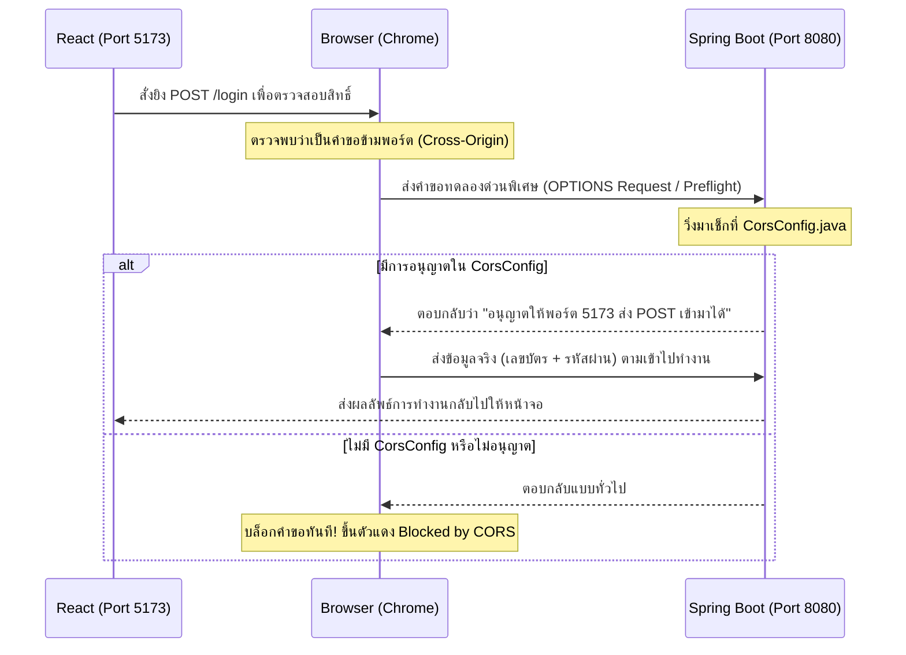

# 🛡️ สรุปเรื่อง CORS (Cross-Origin Resource Sharing) แบบเข้าใจง่าย!

เอกสารนี้อธิบายว่าทำไมโปรเจกต์ของเราถึงจำเป็นต้องมีไฟล์ตั้งค่า **CORS (CorsConfig.java)** และทำไมถึงขาดไฟล์นี้ไปไม่ได้ในการพัฒนาเว็บแอปพลิเคชันยุคปัจจุบัน

---

## 1. CORS คืออะไร? และทำไมถึงสำคัญ?

ก่อนจะเข้าใจ CORS ต้องรู้จักกฎความปลอดภัยของเบราว์เซอร์ (เช่น Chrome, Edge, Safari) ที่ชื่อว่า **Same-Origin Policy (นโยบายแหล่งกำเนิดเดียวกัน)**

### 🚫 กฎ Same-Origin Policy (ความปลอดภัยสูงสุดของเบราว์เซอร์)
เบราว์เซอร์จะป้องกันไม่ให้เว็บไซต์จากโดเมนหนึ่ง (หรือพอร์ตหนึ่ง) เขียนสคริปต์ไปดึงข้อมูลหรือยิงคำขอข้ามไปอีกโดเมนหนึ่งโดยไม่ได้รับอนุญาต เพื่อป้องกันการโจรกรรมข้อมูลข้ามเว็บไซต์

ในโปรเจกต์ของคุณ:
* **หน้าบ้าน (React):** รันอยู่ที่พอร์ต `http://localhost:5173` (Origin A)
* **หลังบ้าน (Spring Boot):** รันอยู่ที่พอร์ต `http://localhost:8080` (Origin B)

> 🚨 **ปัญหา:** เนื่องจากรันกันคนละพอร์ต เบราว์เซอร์จะมองว่าทั้งคู่เป็นคนละแหล่งกำเนิดกัน (Cross-Origin) ส่งผลให้เบราว์เซอร์ทำการ **"บล็อกการเชื่อมต่อทันที"** ทำให้ React ยิงข้อมูลมาล็อกอินหรือดึงข้อมูลบริการไม่ได้เลย

### ✅ ทางออกคือ CORS (Cross-Origin Resource Sharing)
CORS คือกลไกที่ทำให้หลังบ้าน (Spring Boot) สามารถบอกใบอนุญาตแก่เบราว์เซอร์ได้ว่า **"ฉันยอมรับและอนุญาตให้เว็บจากพอร์ต 5173 เชื่อมต่อมาหาฉันได้นะ ไม่ต้องบล็อกเขา"**

---

## 2. ลำดับเหตุการณ์เชื่อมต่อ (เบราว์เซอร์ ตรวจสอบอย่างไร?)

เมื่อ React จะทำการส่งข้อมูล เช่น การกดยืนยันการลงชื่อเข้าใช้งาน (`POST /login`):



---

## 3. อธิบายสิ่งที่ตั้งค่าไว้ใน `CorsConfig.java` ของคุณ

ในไฟล์ **[CorsConfig.java](file:///d:/2568/2568_2/project_demo01/src/main/java/com/example/demo/config/CorsConfig.java)** แต่ละส่วนทำหน้าที่ดังนี้:

```java
@Configuration // 1. ทำงานทันทีที่เปิดระบบหลังบ้าน
public class CorsConfig {

    @Bean // 2. สร้างออบเจกต์ตั้งค่าฝังไว้ในระบบของ Spring
    public WebMvcConfigurer corsConfigurer() {
        return new WebMvcConfigurer() {
            @Override
            public void addCorsMappings(CorsRegistry registry) {
                registry.addMapping("/**") // 3. ใช้กับทุกพาธ URL ในโปรเจกต์
                        .allowedOrigins("http://localhost:5173") // 4. อนุญาตเฉพาะพอร์ตของ React
                        .allowedMethods("GET", "POST", "PUT", "DELETE", "OPTIONS", "PATCH") // 5. อนุญาตการกระทำเหล่านี้
                        .allowedHeaders("*") // 6. หน้าบ้านส่งหัวข้อข้อมูลอะไรมาก็ได้
                        .exposedHeaders("*"); // 7. หน้าบ้านอ่านหัวข้อขอมูลฝั่งส่งกลับได้ทุกตัว
            }
        };
    }
}
```

* **1. `@Configuration` / 2. `@Bean`:** บอกให้ระบบจำไว้ว่านี่คือการตั้งค่าหลักของแอปพลิเคชัน
* **3. `.addMapping("/**")`:** ใช้กฎนี้กับทุก ๆ Controller (เช่น `/login`, `/api/services`, `/api/members` ฯลฯ)
* **4. `.allowedOrigins("http://localhost:5173")`:** กำหนดขอบเขตให้ชัดเจนว่าอนุญาตแค่เว็บไซต์นี้เท่านั้นเพื่อความปลอดภัย ไม่ยอมให้เว็บแปลกปลอมอื่นเชื่อมต่อเข้ามาได้
* **5. `.allowedMethods(...)`:** ด่าน ตม. จะปล่อยให้คำขอที่ใช้วิธี (HTTP Methods) เหล่านี้เดินทางเข้ามาได้ทั้งหมด (ป้องกันเบราว์เซอร์สกัดทิ้งตอนส่งคำขอประเภท `PUT`, `DELETE` หรือ `PATCH`)
* **6. `.allowedHeaders("*")` / 7. `.exposedHeaders("*")`:** ทำให้หลังบ้านและหน้าบ้านสามารถรับ-ส่งข้อมูลเชิงลึกเพิ่มเติม เช่น ข้อมูลหัวข้อ JSON หรือกุญแจยืนยันตัวตน (Token) ได้อย่างอิสระและไร้ข้อจำกัด

---

## 🌟 สรุปสั้น ๆ: ทำไมต้องมี?
หากไม่มีไฟล์ **[CorsConfig.java](file:///d:/2568/2568_2/project_demo01/src/main/java/com/example/demo/config/CorsConfig.java)** นี้:
1. โปรเจกต์หลังบ้านกับหน้าบ้านจะ **"ไม่สามารถคุยกันได้เลย"** บนเครื่องโลคอลของเบราว์เซอร์
2. การแยกโปรเจกต์เป็น 2 ฝั่ง (React & Spring Boot) จะทำงานล้มเหลวทันทีที่เริ่มเรียกใช้ API
