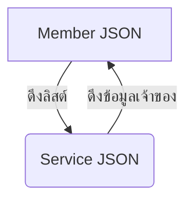

# คู่มือการแก้ปัญหา Infinite Recursion (ข้อมูลวนลูป) ใน JPA & Jackson

คู่มือนี้อธิบายสาเหตุของปัญหาข้อมูลวนลูป (Circular Reference) เมื่อแปลงข้อมูล JPA Entity เป็น JSON ใน Spring Boot และวิธีใช้ `@JsonIgnoreProperties` ในการแก้ไขและจัดรูปแบบข้อมูล

---

## 1. สาเหตุของปัญหา (Circular Reference คืออะไร?)

เมื่อเราออกแบบความสัมพันธ์แบบสองทิศทาง (Bidirectional Relationship) ใน JPA เช่น:
*   **Member** (สมาชิก) ➔ มีหลาย **Service** (`@OneToMany`)
*   **Service** (บริการ) ➔ เป็นของ **Member** (`@ManyToOne`)

เมื่อโปรแกรมต้องการส่งข้อมูลนี้ออกไปหา Client หรือหน้าบ้าน (Frontend) ตัวแปลงข้อมูลตัวหนึ่งชื่อ **Jackson** (JSON Serializer) จะพยายามแปลงวัตถุ Java เหล่านี้ให้เป็นข้อความ JSON โดยการดึงทุก Getter:



**สิ่งที่เกิดขึ้นจริง:**
1. Jackson แปลงข้อมูล `Member`
2. เพื่อแปลงข้อมูลฟิลด์ `service` (ซึ่งเป็น List) ➔ Jackson จะเข้าไปแปลง `Service` ตัวที่ 1
3. ภายใน `Service` มีฟิลด์ `member` ➔ Jackson วนกลับมาแปลง `Member` ใหม่อีกครั้ง
4. วนข้อ 2 และ 3 ไปเรื่อย ๆ ทำให้เกิด JSON ที่โครงสร้างซ้อนลึกไม่สิ้นสุดจนเว็บพังหรือข้อมูลเพี้ยน

---

## 2. วิธีแก้ไขด้วย `@JsonIgnoreProperties`

เราใช้ `@JsonIgnoreProperties` เพื่อทำหน้าที่เป็น **"ตัวดักห้ามแปลงฟิลด์ที่กำหนด"** เพื่อทำลายวงกลม (Break the cycle)

### วิธีเขียนในโค้ดปัจจุบันของคุณ:

#### A) ฝั่งคลาส [Member.java](file:///d:/2568/2568_2/project_demo01/src/main/java/com/example/demo/entity/Member.java)
เราใส่ควบคุมฟิลด์ `service` เพื่อไม่ให้ในข้อมูล `Service` แต่ละชิ้น มีข้อมูล `member` ซ้ำซ้อนโผล่ออกมาอีก:
```java
@OneToMany(mappedBy = "member")
@JsonIgnoreProperties("member") // ➔ "เมื่อแปลงรายการ service ไม่ต้องแปลงฟิลด์ member ที่อยู่ในนั้น"
private List<Service> service;
```

#### B) ฝั่งคลาส [Service.java](file:///d:/2568/2568_2/project_demo01/src/main/java/com/example/demo/entity/Service.java)
เราใส่ควบคุมฟิลด์ `member` และ `officer` เพื่อไม่ให้เวลาดึงข้อมูลดิบของ Service แล้วมีประวัติบริการทั้งหมดซ้อนขึ้นมาซ้ำ:
```java
@ManyToOne
@JoinColumn(name = "member_id")
@JsonIgnoreProperties("service") // ➔ "เมื่อแปลงข้อมูล member ไม่ต้องแปลงลิสต์ service ของเขากลับมาซ้ำ"
private Member member;

@ManyToOne
@JoinColumn(name = "officer_id")
@JsonIgnoreProperties("service") // ➔ "เมื่อแปลงข้อมูล officer ไม่ต้องแปลงลิสต์ service ของเขากลับมาซ้ำ"
private DocumentOfficer officer;
```

---

## 3. เปรียบเทียบผลลัพธ์โครงสร้าง JSON

| แบบวนลูป (มีปัญหา) | แบบตัดลูปด้วย `@JsonIgnoreProperties` (ถูกต้อง) |
| :--- | :--- |
| <pre>{<br>  "memberId": 1,<br>  "firstName": "กิตติ",<br>  "service": [<br>    {<br>      "serviceId": 1001,<br>      "member": {<br>        "memberId": 1,<br>        "service": [<br>          { "serviceId": 1001... }<br>        ]<br>      }<br>    }<br>  ]<br>}</pre> | <pre>{<br>  "memberId": 1,<br>  "firstName": "กิตติ",<br>  "service": [<br>    {<br>      "serviceId": 1001,<br>      "serviceType": "เก็บขยะทั่วไป",<br>      "price": 50<br>    }<br>  ]<br>}</pre> |

---

## 4. ความแตกต่างระหว่าง `@JsonIgnoreProperties` กับ `@JsonIgnore`

เพื่อให้เห็นภาพในการดึง/ซ่อนข้อมูลหน้าบ้านชัดเจนยิ่งขึ้น:

### A) การใช้ `@JsonIgnoreProperties("member")` (ซ่อนเฉพาะบางฟิลด์ข้างใน)
*   **การทำงาน:** ยังส่งลิสต์ `service` ไปหน้าบ้านตามปกติ แต่สั่งซ่อนฟิลด์ `member` ที่อยู่**ข้างใน**แต่ละ `Service` เพื่อไม่ให้เกิดการวนซ้ำและตัดข้อมูลส่วนเกินออก
*   **เมื่อใดควรใช้:** เมื่อยังต้องการดึงข้อมูลความสัมพันธ์ไปแสดงผลหน้าบ้านอยู่ (เช่น ดึง Member แล้วต้องการดูรายการ Service ของเขาด้วย)

### B) การใช้ `@JsonIgnore` (ซ่อนทั้งฟิลด์/ลิสต์ทิ้งไปเลย)
*   **การทำงาน:** ละเว้นหรือซ่อนฟิลด์นั้น ๆ ไปเลยทั้งหมด 100% ไม่ให้ส่งออกมาในโครงสร้าง JSON
*   **เมื่อใดควรใช้:**
    1.  **เพื่อความปลอดภัย:** ซ่อนข้อมูลสำคัญไม่ให้รั่วไหลไปหน้าบ้าน เช่น รหัสผ่าน (`password`)
        ```java
        @Column(name = "password")
        @JsonIgnore // ➔ หน้าบ้านจะไม่ได้รับข้อมูล password นี้เลย
        private String password;
        ```
    2.  **เพื่อตัดข้อมูลที่ไม่ต้องการ:** เช่น ดึงข้อมูล Member มาใช้งานเฉพาะข้อมูลส่วนตัว (Profile) เท่านั้น และต้องการให้ถอดลิสต์ `service` ออกทั้งหมดเลย
        ```java
        @OneToMany(mappedBy = "member")
        @JsonIgnore // ➔ หน้าบ้านจะไม่มีคีย์ "service" ปรากฏออกมาเลย
        private List<Service> service;
        ```
*(หมายเหตุ: ต้องทำการนำเข้า `import com.fasterxml.jackson.annotation.JsonIgnore;` เสมอเมื่อเรียกใช้งาน)*

---

## 5. สรุปคำแนะนำสำหรับการเลือกใช้งานในระบบของคุณ (Summary & Best Practices)

เพื่อการออกแบบ API และการพัฒนาส่วนหน้าบ้าน (Frontend) ที่ดีที่สุด แนะนำแนวทางดังนี้:

1.  **สำหรับความสัมพันธ์ทั่วไป (เช่น `service`):**
    *   **แนะนำให้ใช้:** `@JsonIgnoreProperties("member")` (แบบที่ดึงข้อมูลความสัมพันธ์ไปแสดงผลด้วย)
    *   **เหตุผล:** หน้าบ้านต้องการดึงข้อมูลสมาชิกเพียงครั้งเดียว (Single API Request) ก็จะได้ทั้งข้อมูลโปรไฟล์และประวัติการรับบริการไปแสดงบนหน้าจอทันที ไม่ต้องเขียนโค้ดเรียก API หลายรอบให้เสียเวลาและเปลืองพลังงานเซิร์ฟเวอร์
2.  **สำหรับข้อมูลความปลอดภัย / ข้อมูลละเอียดอ่อน (เช่น `password`):**
    *   **แนะนำให้ใช้:** `@JsonIgnore` เสมอ
    *   **เหตุผล:** เพื่อป้องกันไม่ให้ข้อมูลสำคัญอย่างรหัสผ่านรั่วไหลไปปรากฏในเครือข่ายอินเทอร์เน็ตหรือฝั่งหน้าบ้านโดยไม่จำเป็น

---

## 6. ความรู้เพิ่มเติม: การจัดการเรื่อง CORS ด้วย `@CrossOrigin`

เมื่อคุณเชื่อมต่อระหว่างหน้าบ้าน (Frontend - เช่น React พอร์ต 3000) และหลังบ้าน (Backend - Spring Boot พอร์ต 8081) บราวเซอร์จะเปิดระบบความปลอดภัยเพื่อบล็อกไม่ให้ดึงข้อมูลกันเนื่องจากอยู่คนละพอร์ต (CORS Error)

### `@CrossOrigin(origins = "*")` คืออะไร?
*   **การทำงาน:** บอกให้เซิร์ฟเวอร์ Spring Boot อนุญาตให้เว็บไซต์อื่นเข้ามาขอใช้ข้อมูลจาก API เส้นนี้ได้
*   **เครื่องหมาย `*` (Wildcard):** หมายถึง **"อนุญาตทั้งหมด"** ไม่ว่าหน้าบ้านจะส่งมาจาก URL/พอร์ตใด ก็เข้าถึงข้อมูลได้โดยตรง
*   **การใส่ในโค้ด (เช่นใน Controller):**
    ```java
    @RestController
    @RequestMapping("/service")
    @CrossOrigin(origins = "*") // ➔ อนุญาตให้ทุกหน้าบ้านเชื่อมต่อพอร์ตนี้ได้
    public class ServiceController { ... }
    ```
*   **ข้อแนะนำในการขึ้นระบบจริง (Production):** ควรเปลี่ยนจาก `*` เป็น URL ของหน้าบ้านจริง ๆ เพื่อความปลอดภัย:
    ```java
    @CrossOrigin(origins = "http://my-frontend-website.com")
    ```
