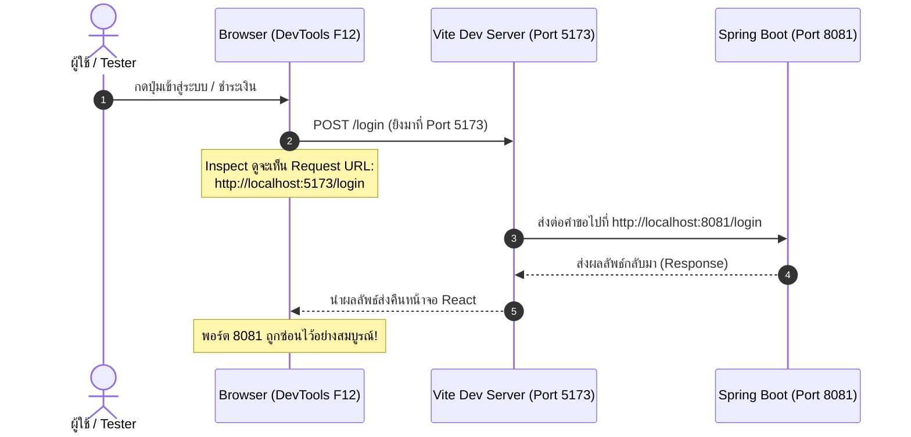

# 🔀 คู่มือสรุปเรื่อง Vite Proxy (การซ่อนพอร์ตและแก้ไขปัญหาเชื่อมต่อหลังบ้าน)

เอกสารนี้รวบรวมหลักการ วิธีการตั้งค่า และเหตุผลที่โปรเจกต์เว็บสมัยใหม่นิยมใช้ **Vite Proxy** ในไฟล์ `vite.config.js` เพื่อซ่อนพอร์ตของ Backend (Spring Boot) และทำให้โค้ดฝั่ง Frontend สะอาด ยืดหยุ่นขึ้น

---

## 1. Vite Proxy คืออะไร? ทำงานอย่างไร?

ในการพัฒนาเว็บทั่วไป:
* **Frontend (React/Vite):** รันอยู่ที่ `http://localhost:5173`
* **Backend (Spring Boot):** รันอยู่ที่ `http://localhost:8081`

ปกติถ้าเราเขียนโค้ดเรียกตรงๆ เช่น `axios.post('http://localhost:8081/login', data)`:
1. เบราว์เซอร์จะยิงข้ามพอร์ตไปยัง `8081` โดยตรง
2. ใครที่กด **Inspect (F12) -> แถบ Network** จะเห็นชัดเจนว่า Backend รันอยู่ที่พอร์ต `8081`
3. อาจเจอปัญหา **CORS (Cross-Origin Resource Sharing)** ได้ง่ายหากฝั่ง Backend ไม่ได้อนุญาตไว้

### 💡 ทางออกด้วย Vite Proxy (ตัวกลางส่งต่อข้อมูล)
Vite Dev Server มีฟีเจอร์จำลองตัวเองเป็น **"ตัวแทน (Reverse Proxy)"** ให้หน้าบ้าน:
* เบราว์เซอร์จะส่งคำขอไปหา **พอร์ต 5173 ของตัวเอง** เสมอ
* เมื่อ Vite เห็นคำขอ มันจะหยิบคำขอนั้นไปส่งต่อให้ **พอร์ต 8081** หลังบ้านแทนเรา
* เมื่อได้ผลลัพธ์กลับมา Vite ก็นำคำตอบนั้นมาส่งคืนให้เบราว์เซอร์



---

## 2. วิธีการตั้งค่าในไฟล์ `vite.config.js`

### รูปแบบที่ 1: แบบย่อ (Shorthand Syntax)
เหมาะสำหรับโปรเจกต์ทั่วไปที่รันบนเครื่องตัวเอง (localhost) เขียนสั้น กระชับ:

```javascript
import { defineConfig } from 'vite'
import react from '@vitejs/plugin-react'

export default defineConfig({
  plugins: [react()],
  server: {
    proxy: {
      '/login': 'http://localhost:8081',
      '/api': 'http://localhost:8081',
    }
  }
})
```

---

### รูปแบบที่ 2: แบบเต็ม (Object Syntax พร้อม `changeOrigin: true`) ⭐ *แนะนำตามมาตรฐาน*
เป็นแบบที่นิยมที่สุดในระดับสากล เพราะรองรับการปรับแต่งที่ยืดหยุ่นและปลอดภัยกว่า:

```javascript
import { defineConfig } from 'vite'
import react from '@vitejs/plugin-react'

export default defineConfig({
  plugins: [react()],
  server: {
    proxy: {
      '/login': {
        target: 'http://localhost:8081',
        changeOrigin: true,
      },
      '/api': {
        target: 'http://localhost:8081',
        changeOrigin: true,
      },
    },
  },
})
```

---

## 3. เปรียบเทียบ: แบบย่อ vs แบบเต็ม ต่างกันอย่างไร?

| หัวข้อ | แบบสั้น (`'http://localhost:8081'`) | แบบเต็ม (`{ target: '...', changeOrigin: true }`) |
| :--- | :--- | :--- |
| **ความสะดวก** | สั้น พิมพ์ง่าย รวดเร็ว | ละเอียด มีโครงสร้างชัดเจน |
| **Header `Host`** | ส่ง `Host: localhost:5173` ไปให้ Backend | ปลอมแปลง `Host: localhost:8081` ให้เสร็จสรรพ |
| **ความเสี่ยง CORS** | อาจมีปัญหากับ Backend บางตัวที่ตรวจ Host ละเอียด | หมดปัญหาเรื่อง Host ทันที 100% |
| **การปรับแต่งเพิ่มเติม** | ทำไม่ได้ | เพิ่ม `rewrite`, `secure`, `ws` (WebSocket) ได้ |

### 🔍 ขยายความ: `changeOrigin: true` สำคัญอย่างไร?
เมื่อเบราว์เซอร์ส่งคำขอมาที่ Frontend ค่า `Host Header` จะเป็น `localhost:5173`:
- **ถ้า `changeOrigin: false` (หรือแบบย่อ):** Vite จะส่ง `Host: localhost:5173` ต่อไปให้ Spring Boot ซึ่งถ้าเซิร์ฟเวอร์หลังบ้านมีการตรวจเช็คความปลอดภัยหรือสร้าง Redirect URL อัตโนมัติ อาจเกิดข้อผิดพลาดได้
- **ถ้า `changeOrigin: true`:** Vite จะ "สวมรอย" และเปลี่ยน Header เป็น `Host: localhost:8081` ทำให้ Spring Boot รู้สึกเสมือนว่าคำขอนั้นส่งมาจากตัวมันเองโดยตรง

---

## 4. การปรับโค้ดฝั่ง React (Frontend)

เมื่อตั้งค่าใน `vite.config.js` เสร็จแล้ว ให้ปรับการเรียกใช้งานในคอมโพเนนต์ต่างๆ ดังนี้:

### ตัวอย่างที่ 1: หน้า Login (`Login.jsx`)
```javascript
// ❌ แบบเดิม (เปิดเผยพอร์ต 8081 ให้คนอื่นเห็น)
const response = await axios.post('http://localhost:8081/login', data);

// ✅ แบบใหม่ผ่าน Proxy (ซ่อนพอร์ต 8081)
const response = await axios.post('/login', data);
```

### ตัวอย่างที่ 2: หน้าชำระเงิน / ดูบิล (`PaymentSection.jsx`, `Invoice.jsx`)
```javascript
// ❌ แบบเดิม
const res = await axios.get('http://localhost:8081/api/invoices/member/1');
const pay = await axios.post('http://localhost:8081/api/payments', data);

// ✅ แบบใหม่ผ่าน Proxy
const res = await axios.get('/api/invoices/member/1');
const pay = await axios.post('/api/payments', data);
```

---

## 5. ประโยชน์ 4 ข้อหลักที่ได้จากการใช้ Vite Proxy

1. **ความปลอดภัยและการปกปิดข้อมูล (Security by Obscurity):**
   - ผู้ใช้งานหรือผู้ตรวจสอบภายนอกจะไม่เห็นว่าเราแยกระบบหลังบ้านไว้ที่พอร์ตหรือไอพีใด
2. **แก้ปัญหา CORS ได้อย่างถาวรในขณะพัฒนา (No CORS Issue):**
   - เนื่องจากเบราว์เซอร์คุยกับพอร์ต `5173` ที่เป็นแหล่งกำเนิดเดียวกัน (Same-Origin) จึงไม่เกิดข้อผิดพลาด CORS บล็อกคำขอ
3. **โค้ดสะอาดและยืดหยุ่น (Maintainability):**
   - เราใช้เส้นทางสัมพัทธ์ (Relative URL) เช่น `/api/...` แทนการ Hardcode `http://localhost:8081` กระจายอยู่ทุกไฟล์
4. **สะดวกมากเวลา Deploy ขึ้นเซิร์ฟเวอร์จริง (Production Ready):**
   - เมื่อนำไประบบจริงที่มี Domain (เช่น `https://mycity-garbage.com`) หน้าบ้านและหลังบ้านจะแชร์ Domain เดียวกันผ่าน Reverse Proxy (Nginx) อยู่แล้ว โค้ดฝั่ง React จะไม่ต้องแก้ URL แม้แต่บรรทัดเดียว!

---

## 6. ข้อควรระวังและสิ่งที่ต้องจำ (Important Notes)

> [!IMPORTANT]
> 1. **ต้อง Restart Server เสมอ:** ทุกครั้งที่แก้ไขไฟล์ `vite.config.js` จะต้องกด `Ctrl + C` แล้วรัน `npm run dev` ใหม่อีกครั้งเสมอ เพื่อให้ Vite โหลดคอนฟิกใหม่
> 2. **Vite Proxy ทำงานเฉพาะตอน Dev:** การตั้งค่า `server.proxy` ใน `vite.config.js` มีผลเฉพาะเวลาเราสั่ง `npm run dev` เท่านั้น ถ้าวันข้างหน้าเรา `npm run build` เป็นไฟล์ HTML/JS เปล่าๆ ไปวางบน Production เซิร์ฟเวอร์จริง หน้าที่นี้จะถูกยกให้ **Nginx** หรือ Web Server ทำแทนในลักษณะ Reverse Proxy เช่นเดียวกัน
