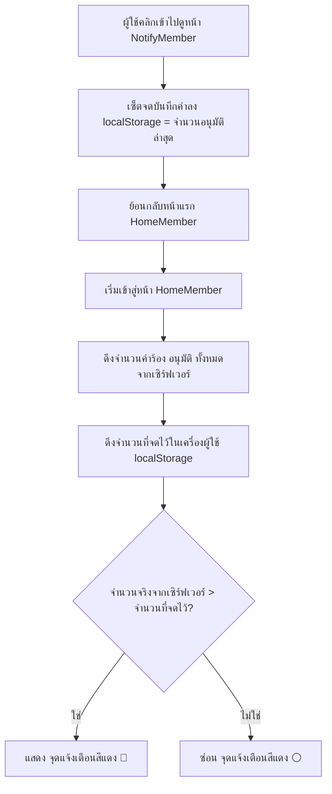

# คู่มือระบบแจ้งเตือนไดนามิกด้วย LocalStorage (Dynamic Notification System Guide)

คู่มือฉบับนี้อธิบายแนวคิด โครงสร้างโค้ด และการทำงานของระบบแจ้งเตือนด้วย **จุดสีแดง (Red Dot Notification Badge)** แบบเรียลไทม์โดยอาศัยประโยชน์จาก `localStorage` ของเบราว์เซอร์ ซึ่งระบบนี้จะไม่รบกวนทรัพยากรบนเซิร์ฟเวอร์ในการเก็บประวัติการอ่านของผู้ใช้แต่ละคน

---

## 1. แนวคิดสถาปัตยกรรม (Architecture Concept)

ระบบนี้จะแบ่งการเปรียบเทียบข้อมูลจำนวนคำร้องออกเป็น 2 แหล่งหลัก ได้แก่:
1. **ข้อมูลในฐานข้อมูล (เซิร์ฟเวอร์):** จำนวนรายการคำร้องทั้งหมดที่ได้รับสถานะ `"อนุมัติ"`
2. **ข้อมูลในเครื่องผู้ใช้ (บราวเซอร์):** จำนวนรายการคำร้องอนุมัติที่ผู้ใช้ได้เปิดอ่านครั้งล่าสุด ซึ่งจะถูกจดจำไว้ใน `localStorage` ด้วยคีย์ที่กําหนดขึ้น



---

## 2. โครงสร้างโค้ดของระบบที่ใช้ร่วมกัน

ระบบนี้ทำหน้าที่เชื่อมโยงระหว่าง 3 ไฟล์หลัก คือหน้าแสดงผลแรก (`HomeMember.jsx`), หน้าอ่านรายละเอียดแจ้งเตือน (`NotifyMember.jsx`) และไฟล์สไตล์ดีไซน์ (`HomeMember.css`)

### ส่วนที่ 1: ตรวจสอบและแสดงสัญลักษณ์แจ้งเตือนในหน้าแรก [HomeMember.jsx](file:///d:/2568/2568_2/my-total-project/project_demofornend/src/JSX/Member/HomeMember.jsx)

ในส่วนของ `useEffect` จะทำการโหลดข้อมูล และเปรียบเทียบเพื่อคำนวณสิทธิ์การแสดงผลจุดสีแดง:

```javascript
const [hasNewApproval, setHasNewApproval] = useState(false);

useEffect(() => {
    const fetchMember = async () => {
        // ... (ส่วนการค้นหาและเซ็ตข้อมูล member) ...
        if (foundMember) {
            setMember(foundMember);

            // 1. ดึงข้อมูลรายการจาก API
            const serviceResponse = await axios.get(`http://localhost:8081/api/services/member/${foundMember.memberId}`);
            const services = serviceResponse.data;

            // 2. คัดกรองนับจำนวนรายการที่ "อนุมัติ" ในฐานข้อมูลปัจจุบัน
            const approvedServices = services.filter(s => s.status === 'อนุมัติ');

            // 3. ดึงจำนวนที่เราเคยบันทึกไว้ในบราวเซอร์ขึ้นมา (หากยังไม่มีให้ตั้งต้นเป็น '0')
            const lastSeenCount = parseInt(localStorage.getItem('seenApprovedCount') || '0', 10);

            // 4. เปรียบเทียบ หากมีข้อมูลใหม่เข้ามาเพิ่มขึ้น ให้ตั้งค่าเพื่อเปิดจุดสีแดง
            if (approvedServices.length > lastSeenCount) {
                setHasNewApproval(true);
            } else {
                setHasNewApproval(false);
            }
        }
    }
    fetchMember();
}, [onNavigate]);
```

ในส่วนของการวางโครงสร้าง HTML/JSX (กล่องปุ่มสำหรับลิงก์ไปหน้าแจ้งเตือน):

```jsx
<div className="action-card" onClick={() => onNavigate('notifyMember')}>
    {/* การเพิ่ม position: relative ใน style เพื่อล็อกขอบเขตจุดแดงในมุมขวาบนของกล่อง */}
    <div className="action-icon-box" style={{ position: 'relative' }}>
        <svg className="action-icon" viewBox="0 0 24 24" fill="none" stroke="currentColor">
            {/* ... โครงสร้างรูปภาพ SVG ... */}
        </svg>
        {/* แสดงจุดสีแดงก็ต่อเมื่อมีรายการอนุมัติชิ้นใหม่เข้ามา */}
        {hasNewApproval && <span className="red-dot-badge"></span>}
    </div>
    <h4 className="action-title">แจ้งเตือน</h4>
    <p className="action-desc">แจ้งความประสงค์ขอรับการจัดเก็บขยะทั่วไป/ขยะขนาดใหญ่</p>
</div>
```

---

### ส่วนที่ 2: การจดจำและล้างการแจ้งเตือนในหน้าอ่าน [NotifyMember.jsx](file:///d:/2568/2568_2/my-total-project/project_demofornend/src/JSX/Member/NotifyMember.jsx)

เมื่อผู้ใช้เปิดหน้านี้ขึ้นมา จะมองว่าผู้ใช้เข้ามารับทราบข่าวสารแล้ว โค้ดจะจดจำนวนรายการอนุมัติ ณ ตอนนั้นเก็บลงในหน่วยความจำของระบบทันที:

```javascript
if (foundMember) {
    setMember(foundMember);
    const response = await axios.get(`http://localhost:8081/api/services/member/${foundMember.memberId}`);
    const services = response.data;
    setServices(services);

    // ทำการกรองและบันทึกจำนวนที่ "อนุมัติ" ปัจจุบันลงใน localStorage
    const approvedCount = services.filter(s => s.status === 'อนุมัติ').length;
    localStorage.setItem('seenApprovedCount', approvedCount.toString());
}
```

---

### ส่วนที่ 3: สไตล์ดีไซน์จุดสีแดงแจ้งเตือน [HomeMember.css](file:///d:/2568/2568_2/my-total-project/project_demofornend/src/CSS/HomeMember.css)

ตัวช่วยตกแต่งให้จุดสัญญลักษณ์สีแดงลอยอยู่ที่มุมของไอคอนอย่างแม่นยำด้วยการควบคุมพิกัดขอบบนและขอบขวา:

```css
/* คลาสสำหรับจุดแดงบนไอคอนการ์ด */
.red-dot-badge {
  position: absolute;
  top: 2px;
  right: 2px;
  width: 10px;
  height: 10px;
  background-color: #ef4444; /* รหัสสีแดงสว่างแบบพรีเมียม */
  border-radius: 50%;
  border: 2px solid #ffffff; /* ขอบขาวเพื่อให้ตัดกับพื้นหลังของกล่องไอคอนได้อย่างชัดเจน */
  box-shadow: 0 0 6px rgba(239, 68, 68, 0.6); /* เอฟเฟกต์เงาฟุ้งของแสงไฟแจ้งเตือน */
}
```

---

## 3. วิธีการนำรูปแบบนี้ไปประยุกต์ใช้กับปุ่มฟังก์ชันอื่น (Reusability Guide)

หากท่านมีฟังก์ชันประเภทอื่นในหน้า `HomeMember` เช่น **"ข่าวสาร"** หรือ **"บริการแลกสินค้า"** และอยากให้มีจุดแดงแจ้งเตือนเช่นเดียวกัน สามารถคัดลอกรูปแบบการจดนี้ไปใช้ได้ทันที เพียงอัปเดตองค์ประกอบ 2 ส่วนดังนี้:

### สรุปคีย์หน่วยความจำที่แนะนำสำหรับแบ่งแยกหัวข้อ

| บริการ / ฟังก์ชัน | คีย์ที่บันทึกในเครื่อง (`localStorage`) | อ้างอิงแหล่งข้อมูล API ที่นำมาเช็ก |
| :--- | :--- | :--- |
| **ติดตามคำขอขยะ** | `'seenApprovedCount'` | `/api/services/member/{memberId}` (เช็กสถานะ `"อนุมัติ"`) |
| **ข่าวสารและประกาศ** | `'seenAnnouncementCount'` | `/api/announcements` (นับจำนวนบทความข่าวทั้งหมด) |
| **การแลกสินค้าสะสมแต้ม** | `'seenRedeemedCount'` | `/api/redeem/member/{memberId}` (เช็กสถานะการแลกพัสดุสำเร็จ) |

### กฎการนำไปประยุกต์ใช้ซ้ำ:
1. **คัดลอกลอจิกการคำนวณจำนวนจริง** บนหน้า `HomeMember.jsx` แยกกันโดยใช้ state ของตัวมันเอง เช่น `const [hasNewNews, setHasNewNews] = useState(false)`
2. **เทียบค่าเฉพากคีย์** ของใครของมันเพื่อไม่ให้ค่าทับซ้อนกันในเครื่อง
3. **สั่งจดบันทึกใหม่** เฉพาะเมื่อผู้ใช้วิ่งเข้าไปใช้งานในหน้าฟังก์ชันนั้นๆ
