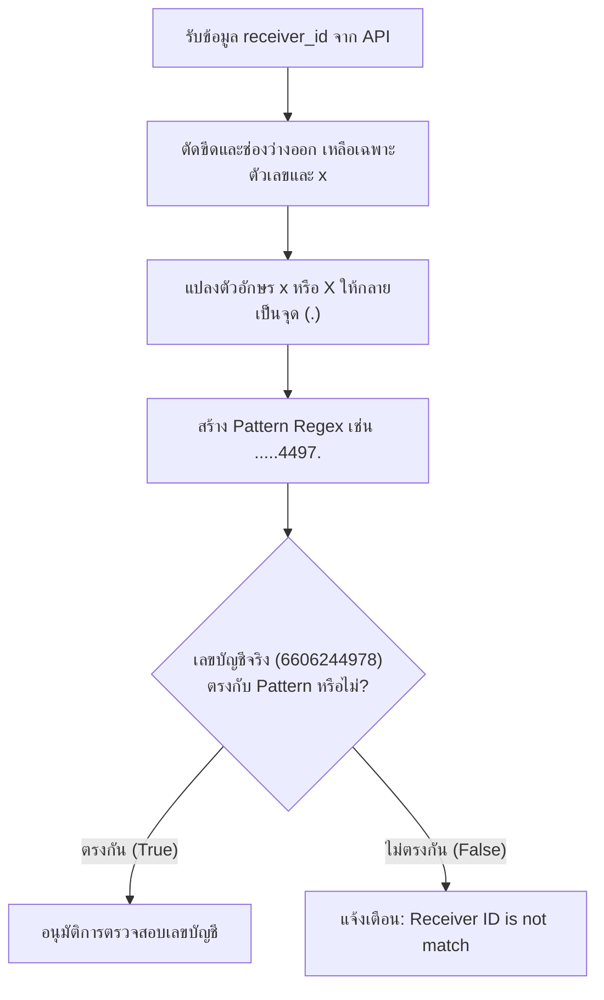

# เอกสารอธิบายการทำงานของระบบตรวจสอบสลิปโอนเงิน (Slip Verification)
## การจัดการเลขบัญชีที่ถูกเซนเซอร์ (Masked Account Matching) ด้วย Regular Expression

---

### 1. ความเป็นมาและปัญหา (Problem Statement)
ในการพัฒนาระบบตรวจสอบสลิปโอนเงินอัตโนมัติผ่านทาง API (Slip Verification Service) ระบบจำเป็นต้องตรวจสอบความถูกต้องของ **"เลขบัญชีผู้รับเงิน (Receiver Account Number)"** เพื่อให้แน่ใจว่าผู้ใช้งานโอนเงินเข้าบัญชีของหน่วยงาน (เทศบาลตำบลทุ่งหัวช้าง) จริง ไม่ใช่การนำสลิปที่โอนให้บุคคลอื่นมาแอบอ้าง

อย่างไรก็ตาม ธนาคารพาณิชย์ในประเทศไทยแต่ละแห่งมีนโยบายความปลอดภัยและการรักษาข้อมูลส่วนบุคคล (PDPA) ที่แตกต่างกัน ทำให้ข้อมูลเลขบัญชีบนสลิปที่ API สกัดออกมาได้ถูก **เซนเซอร์ (Mask) ปิดบังตัวเลขบางตำแหน่งด้วยตัวอักษร `x` หรือ `X`** ในตำแหน่งที่ไม่ตรงกัน เช่น:
* **ธนาคาร A (ปิดหัว-ท้าย):** `xxx-x-x4497-x` (แสดงเฉพาะ 4497)
* **ธนาคาร B (ปิดหัว):** `xxxxxx4978` (แสดงเฉพาะ 4978)
* **ธนาคาร C (ปิดกลาง):** `660-x-xxxxx-8` (แสดงหัวและท้าย)

> [!WARNING]
> **ข้อจำกัด:** ระบบไม่สามารถใช้คำสั่งเปรียบเทียบข้อความแบบตรงๆ เช่น `String.equals("6606244978")` หรือ `String.contains("เลขชุดใดชุดหนึ่ง")` ได้ เพราะหากผู้ใช้โอนมาจากธนาคารที่เซนเซอร์ตำแหน่งต่างออกไป ระบบจะตัดสินว่าสลิปไม่ถูกต้องทันที

---

### 2. เหตุผลทางเทคนิค: ทำไมต้องแปลงตัวอักษร `x` ให้เป็นเครื่องหมายจุด `.`
ในการประมวลผลสตริงของภาษาคอมพิวเตอร์ (รวมถึง Java):

1. **คอมพิวเตอร์มอง `x` เป็นตัวอักษรจริง (Literal Character):**  
   คอมพิวเตอร์จะมองว่า `x` คือตัวอักษรภาษาอังกฤษ ไม่ได้มีคุณสมบัติแทนตัวเลขใดๆ ในเลขบัญชีจริง `"6606244978"` ไม่มีตัวอักษร `x` อยู่เลย ดังนั้นการนำสตริงที่มี `x` ไปตรวจเทียบตรงๆ จะได้ผลลัพธ์เป็นเท็จ (`false`) เสมอ

2. **คุณสมบัติของ Regular Expression (Regex):**  
   ในระบบ Regex สากล **เครื่องหมายจุด (`.`)** ถูกกำหนดให้เป็น **Wildcard Character** หมายถึง *"สามารถเป็นตัวอักษรหรือตัวเลขตัวใดก็ได้จำนวน 1 ตัว"*

ด้วยหลักการนี้ หากเราแปลงตัวอักษร `x` ที่ถูกเซนเซอร์มาให้กลายเป็นเครื่องหมายจุด `.` คอมพิวเตอร์จะเข้าใจทันทีว่า **"ตำแหน่งที่มีจุดคือช่องว่าง จะเป็นเลขอะไรก็ได้ ขอเพียงแค่ตำแหน่งตัวเลขที่เหลือตรงกันก็เพียงพอ"**

---

### 2.1 ข้อแตกต่างระหว่าง "การลบตัวอักษรทิ้ง" กับ "การแทนที่ด้วยจุด (`.`)"

หลายคนอาจสงสัยว่า *ทำไมเราไม่ลบตัวอักษร `x` และขีด `-` ทิ้งไปเลย ให้เหลือเฉพาะตัวเลขที่อ่านได้?*

หากเราเลือกใช้วิธี **"ลบตัวอักษรทิ้ง (Delete/Strip)"** จะก่อให้เกิดข้อผิดพลาดร้ายแรง 2 ประการ:

1. **เกิดช่องโหว่ความปลอดภัย (Security Vulnerability):**
   * สมมติมิจฉาชีพนำสลิปที่โอนไปยังบัญชีอื่นมาส่ง เช่น `999-x-x4497-x` (เป็นบัญชีของคนอื่น ไม่ใช่บัญชีเทศบาล)
   * หากระบบลบ `x` ทิ้ง จะเหลือข้อความตัวเลขคือ `"4497"`
   * เมื่อนำไปเช็คด้วยคำสั่ง `"6606244978".contains("4497")` ระบบจะตัดสินว่า **"ผ่าน"** ทันที ทั้งๆ ที่เงินไม่ได้โอนเข้าบัญชีเทศบาล
2. **ตำแหน่งตัวเลขผิดเพี้ยนเมื่อธนาคารปิดเลขตรงกลาง:**
   * สมมติธนาคารปิดเลขตรงกลางมาเป็น `660-x-xxxxx-8`
   * หากลบ `x` ทิ้ง ตัวเลขด้านหน้าและด้านหลังจะถูกดึงมาชิดกัน กลายเป็น `"6608"`
   * เมื่อนำไปเช็คกับเลขบัญชีจริง `"6606244978"` จะพบว่าไม่มีลำดับตัวเลข `"6608"` อยู่ติดกันเลย ส่งผลให้สลิปที่โอนเข้าบัญชีเทศบาลจริงๆ **ตรวจไม่ผ่าน**

| วิธีการจัดการข้อมูล | ตัวอย่างสลิป `660-x-xxxxx-8` | ข้อมูลที่ระบบประมวลผล | ผลการทำงาน |
| :--- | :---: | :---: | :--- |
| **1. แค่ลบขีด (`replace("-", "")`)** | `660-x-xxxxx-8` | `"660xxxxxx8"` | ❌ ไม่ผ่าน (ติดตัวอักษร x) |
| **2. ลบตัวอักษรทิ้งทั้งหมด** | `660-x-xxxxx-8` | `"6608"` (เลขถูกดึงมาชิดกัน) | ❌ ไม่ผ่าน (ตำแหน่งหลักสูญหาย) |
| **3. แทนที่ตัวอักษรด้วยจุด (`.`)** | `660-x-xxxxx-8` | `"660......8"` (คงตำแหน่ง 10 หลักไว้) | ✅ **ผ่านอย่างถูกต้อง 100%** |

---

### 3. กระบวนการทำงานของอัลกอริทึม (Algorithm Flow)



#### รายละเอียดการแปลงข้อมูลตัวอย่าง:
* ข้อมูลดิบจาก API: `"xxx-x-x4497-x"`
* ตัดอักขระพิเศษ: `"xxxxx4497x"`
* แปลงเป็น Regex Pattern: `".....4497."`
* เทียบกับเลขบัญชีจริง: `"6606244978".matches(".....4497.")` $\rightarrow$ **ถูกต้อง (True)**

---

### 4. ซอร์สโค้ดตัวอย่างในภาษา Java (Spring Boot)

```java
// 1. ดึงข้อมูลเลขที่บัญชีผู้รับจากสลิป
String receiverId = (String) dataslip.get("receiver_id");

if (receiverId != null) {
    // 2. ลบอักขระพิเศษที่ไม่ใช่ตัวเลขและไม่ใช่ x ออก
    String cleanMasked = receiverId.replaceAll("[^0-9xX]", "");

    // 3. แปลง x และ X เป็นเครื่องหมายจุด (.) สำหรับ Regex Wildcard
    String pattern = cleanMasked.replaceAll("[xX]", ".");

    // 4. นำเลขบัญชีจริง 10 หลักมาตรวจสอบเทียบกับ Pattern
    if (!"6606244978".matches(pattern)) {
        return "Receiver ID is not match";
    }
}
```

---

### 4.1 ข้อแตกต่างระหว่าง `replace` และ `replaceAll` ในภาษา Java

ในการเขียนโปรแกรมภาษา Java สำหรับการประมวลผลสตริง มีคำสั่งที่ใช้งานบ่อยสองคำสั่งคือ `replace` และ `replaceAll` ซึ่งมีข้อแตกต่างสำคัญดังนี้:

| คุณสมบัติ | `replace(target, replacement)` | `replaceAll(regex, replacement)` |
| :--- | :--- | :--- |
| **ประเภทการค้นหา** | ข้อความตรงตัว (Literal String) | นิพจน์เงื่อนไข (Regular Expression) |
| **การทำงาน** | ค้นหาและแทนที่คำนั้นตรงๆ ตัวต่อตัว | ค้นหาตามรูปแบบเงื่อนไข/กลุ่มตัวอักษร |
| **การรองรับ Pattern** | ❌ ไม่รองรับ Regex (มองสัญลักษณ์พิเศษเป็นอักษรธรรมดา) | ✅ รองรับ Regex (เช่น `[^0-9]`, `[xX]`) |
| **ขอบเขตการแทนที่** | แทนที่ **ทุกจุด** ที่พบ | แทนที่ **ทุกจุด** ที่พบ |

#### ตัวอย่างการใช้งานจริง:
```java
String text = "xxx-123-xxx";

// การใช้ replace (หาตรงตัว)
text.replace("-", ""); // ได้ผลลัพธ์เป็น "xxx123xxx" (ลบเฉพาะขีด)

// การใช้ replaceAll (มีเงื่อนไข Regex)
text.replaceAll("[^0-9]", ""); // ได้ผลลัพธ์เป็น "123" (ลบทุกอย่างที่ไม่ใช่ตัวเลข 0-9)
text.replaceAll("[xX]", ".");   // ได้ผลลัพธ์เป็น "...-123-..." (แปลงทั้ง x เล็กและ X ใหญ่เป็นจุด)
```

> **เหตุผลที่เลือกใช้ `replaceAll` ในระบบนี้:**  
> เนื่องจากเราต้องการกำหนดเงื่อนไขกลุ่มตัวอักษร เช่น `[^0-9xX]` (ทุกอย่างที่ไม่ใช่ตัวเลขและตัว x) และ `[xX]` (ครอบคลุมทั้งตัวพิมพ์เล็กและพิมพ์ใหญ่) ซึ่งคำสั่ง `replace` แบบธรรมดาไม่สามารถทำได้

---

### 5. ตารางตัวอย่างผลการทดสอบ (Test Cases)

| ลำดับ | ข้อมูล `receiver_id` จาก API | Pattern Regex ที่ได้ | บัญชีจริงที่นำไปเทียบ | ผลลัพธ์ | คำอธิบาย |
| :---: | :--- | :--- | :---: | :---: | :--- |
| **1** | `"xxx-x-x4497-x"` | `.....4497.` | `6606244978` | **ผ่าน (Match)** | เลข 4497 ตรงตำแหน่งที่ 5-8 ของบัญชี |
| **2** | `"xxxxxx4978"` | `......4978` | `6606244978` | **ผ่าน (Match)** | เลข 4978 ตรง 4 หลักท้ายของบัญชี |
| **3** | `"660-x-xxxxx-8"` | `660......8` | `6606244978` | **ผ่าน (Match)** | เลข 660 ตรง 3 หลักแรก และ 8 ตรงหลักสุดท้าย |
| **4** | `"xxx-x-x1234-x"` | `.....1234.` | `6606244978` | **ไม่ผ่าน (Mismatch)** | ตำแหน่ง 5-8 คือ 4497 ไม่ตรงกับ 1234 (โอนผิดบัญชี) |
| **5** | `"xxxxxx9999"` | `......9999` | `6606244978` | **ไม่ผ่าน (Mismatch)** | 4 หลักท้ายไม่ตรงกับ 4978 (โอนผิดบัญชี) |

---

### 6. การเพิ่มความปลอดภัยแบบสองชั้น (Dual-Verification)
นอกเหนือจากการตรวจสอบเลขบัญชีด้วย Regular Expression แล้ว ในกระบวนการทำงานจริงของระบบ ควรมีการตรวจสอบความถูกต้องร่วมกับ **ชื่อบัญชีผู้รับ (`receiver_name`)** เนื่องจากชื่อบัญชีจะไม่ถูกเซนเซอร์ด้วยตัวอักษร `x`:

```java
String receiverName = (String) dataslip.get("receiver_name");

// ตรวจสอบทั้งชื่อหน่วยงานและเลขบัญชี
if (receiverName == null || !receiverName.contains("เทศบาลตำบลทุ่งหัวช้าง")) {
    return "Receiver Name is not match";
}
```
การนำทั้งสองวิธีมาใช้งานร่วมกัน จะทำให้ระบบมีความถูกต้อง ปลอดภัยสูงสุด และรองรับสลิปจากทุกธนาคารในประเทศไทยได้อย่างครอบคลุม 100%
